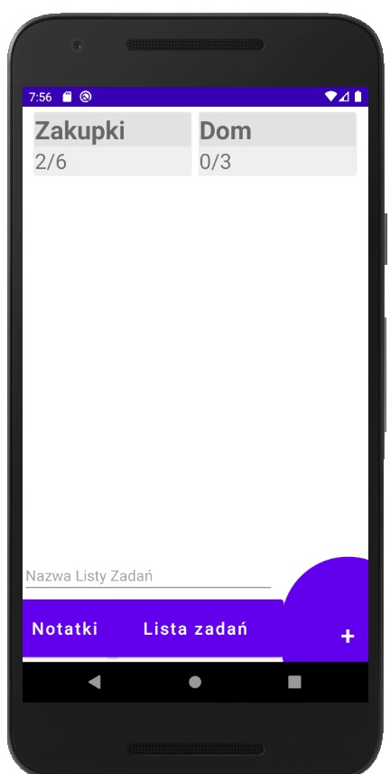
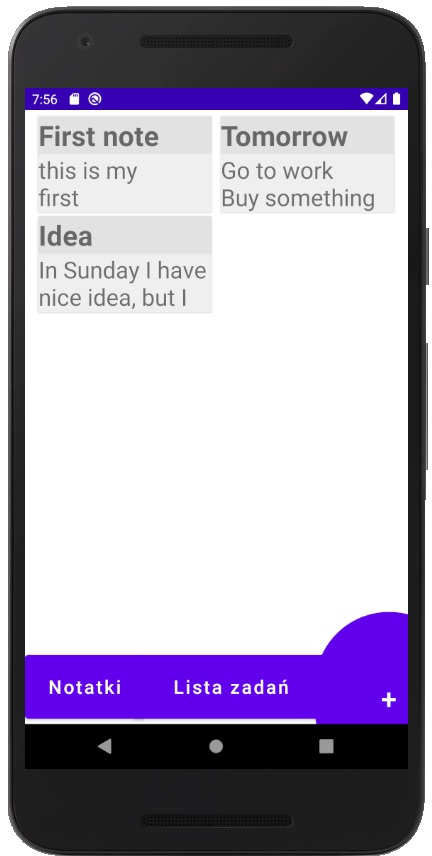
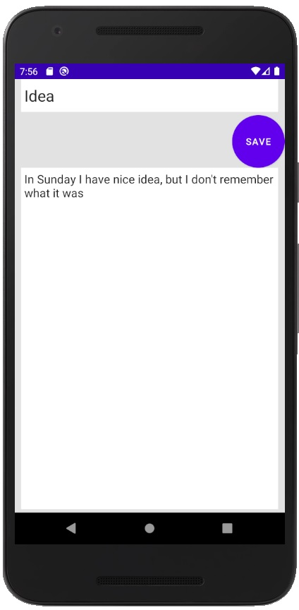

# QuestBook
 
An application that allows you to create lists and notes.

# Table of Contens
* [General info](#general-info)
* [Technologies](#technologies)
* [Features](#features)

## General info

Create a new to-do list,  track their process or delete them. Complete the given tasks in the list or restore them to their previous state. Create your note, which you can edit or delete from the list if necessary.

## Technologies
Kotlin, SQLite and OOP (object oriented programming)

In next project I use: Dagger and MVVM

## Features

A few of the things you can do with QuestBook:
- create list of task
- track the progress of a specific list
- add new task
- completing a given task
- create notes
- edit notes

